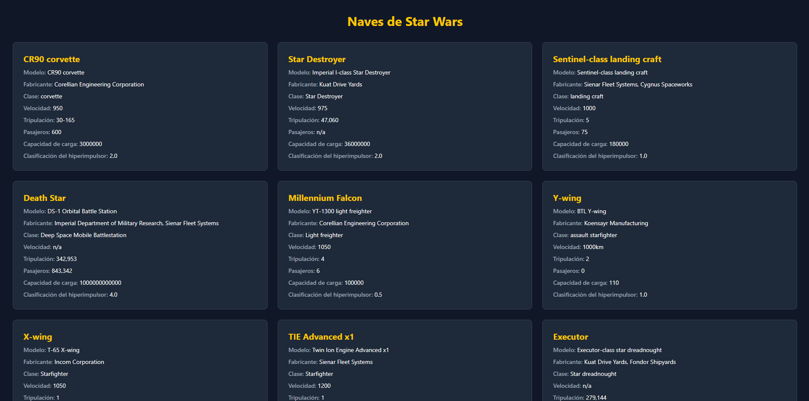

# Star Wars Typed 🚀

🇪🇸 **Español**

Proyecto desarrollado con **React, TypeScript y Vite** para explorar y listar las naves espaciales del universo de Star Wars, consumiendo datos en tiempo real desde una API REST moderna y utilizando **Tailwind CSS v4** para el diseño.

Este proyecto fue desarrollado como parte de la materia de **Desarrollo Front End**.

🇺🇸 **English**

Project developed with **React, TypeScript and Vite** to explore and display Star Wars starships by consuming real-time data from a modern REST API and styled using **Tailwind CSS v4**.

This project was developed as part of the **Front-End Development** course.

---

## 📸 Preview / Demostración



*(Optional / Opcional: Replace this image with a screenshot of your local project later.)*

---

## ✨ Features & Learning Outcomes / Características y Aprendizajes

### 🧩 Component-Based Architecture / Arquitectura Basada en Componentes

🇪🇸  
Separación clara entre la lógica contenedora (`Starships.tsx`) y el componente de presentación (`StarshipCard.tsx`), facilitando la reutilización y mantenibilidad.

🇺🇸  
Clear separation between container logic (`Starships.tsx`) and presentation components (`StarshipCard.tsx`) to improve maintainability and reusability.

---

### 🔷 Strong Typing with TypeScript / Tipado Estricto con TypeScript

🇪🇸  
Uso de interfaces personalizadas para mapear la información obtenida desde la API, evitando el uso de tipos genéricos como `any`.

🇺🇸  
Custom interfaces were implemented to map API data and avoid loose generic types such as `any`.

---

### ⚙️ Lifecycle & State Management / Manejo de Ciclo de Vida y Estados

🇪🇸

Implementación de `useEffect` y `useState` para administrar la carga asíncrona de datos, estados de carga (`loading`) y manejo de excepciones (`error`).

Además, las solicitudes fueron protegidas utilizando **`try/catch`** para controlar fallos durante las peticiones y evitar interrupciones inesperadas en la interfaz.

Ejemplo implementado:

```typescript
useEffect(() => {
    const fetchStarships = async () => {
        try {
            const response = await fetch(API_URL);
            const data = await response.json();

            setStarships(data.results);
        } catch (error) {
            setError(error);
        }
    };

    fetchStarships();
}, []);
```

🇺🇸

`useEffect` and `useState` were implemented to manage asynchronous loading, loading states (`loading`) and error handling (`error`).

Requests were also protected using **`try/catch`** blocks to safely handle API failures and prevent unexpected UI interruptions.

---

### 🚪 Early Return Pattern / Patrón Early Return

🇪🇸

Uso de retornos anticipados para mostrar estados de carga y errores antes del renderizado principal.

🇺🇸

Early return implementation to display loading and error states before rendering the main interface.

---

### 🎨 Native Tailwind CSS v4 / Tailwind CSS v4 Nativo

🇪🇸

Uso de la arquitectura moderna de Tailwind CSS integrada directamente mediante `@tailwindcss/vite`.

🇺🇸

Implementation of Tailwind CSS v4 integrated directly through `@tailwindcss/vite`.

---

## 🛰️ API Integration / Integración con API

🇪🇸

El proyecto consume datos utilizando **SWAPI Info API**, una versión moderna y segura (HTTPS) basada en la API clásica de Star Wars.

Esto permitió trabajar con consumo de datos en tiempo real y estructuras tipadas usando TypeScript.

🇺🇸

The project consumes data through **SWAPI Info API**, a secure HTTPS mirror and modern implementation of the classic Star Wars API.

This enabled real-time API consumption combined with strongly typed TypeScript structures.

---

## 🛠️ Technologies Used / Tecnologías Utilizadas

- React 19 — UI library / Librería para interfaces
- TypeScript — Strong typing / Tipado estricto
- Vite — Fast build tool / Herramienta de compilación rápida
- Tailwind CSS v4 — Utility-first CSS framework
- SWAPI Info API — Modern Star Wars REST API

---

## 🚀 Installation & Execution / Instalación y Ejecución

### Clone repository / Clonar repositorio

```bash
git clone https://github.com/ITzDier/Star_Wars_Typed.git
```

```bash
cd Star_Wars_Typed
```

### Install dependencies / Instalar dependencias

```bash
npm install
```

### Run development server / Ejecutar entorno local

```bash
npm run dev
```

Open:

```text
http://localhost:5173
```

---

## 📁 Project Structure / Estructura General

```text
src/
│── assets/
│── components/
│── pages/
│── interfaces/
│── App.tsx
└── main.tsx
```

---

## ✒️ Author / Autor

**Jesús Blanco Andrade**

GitHub:
https://github.com/ITzDier

---

## 📄 License / Licencia

This project is licensed under the GPL 3.0 License.

Este proyecto está bajo la Licencia GPL 3.0.